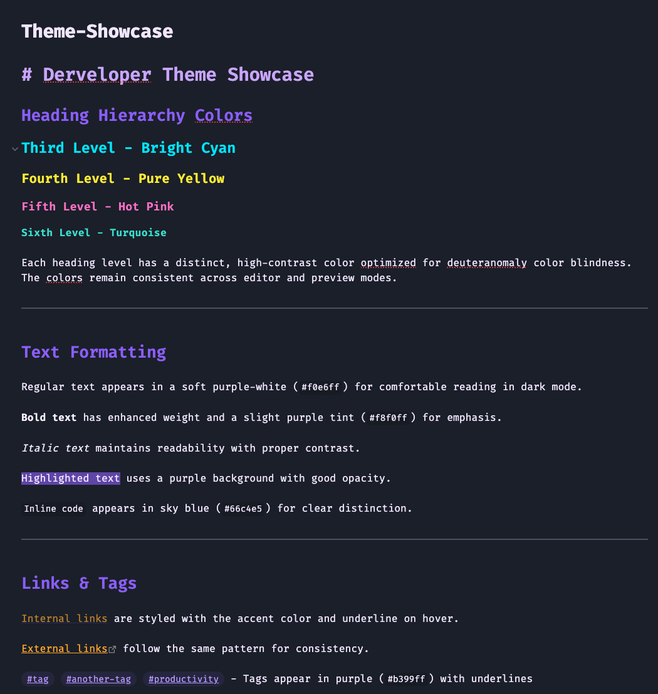

# Derveloper Theme for Obsidian

A dark theme with flat design, optimized for red-green color blindness (deuteranomaly).

## About

This theme is based on [Dark Moss](https://github.com/sergey900553/obsidian_githublike_theme) and was ported and adapted using LLM assistance. It's a purely private project with no commercial intentions or claims.

## Features

- **High-contrast heading colors** - Six distinct colors for each heading level, optimized for deuteranomaly
- **Flat design** - Clean, modern interface with no rounded corners  
- **Optimized for dark mode** - Comfortable for extended use
- **Print-ready** - Special CSS for clean PDF exports with multi-column support

## Color Palette

- **H1**: Bright violet (`#c8a6ff`)
- **H2**: Strong purple (`#8a61ff`)  
- **H3**: Bright cyan (`#00e5ff`)
- **H4**: Pure yellow (`#ffea00`)
- **H5**: Hot pink (`#ff6ec7`)
- **H6**: Turquoise (`#40e0d0`)

## Installation

1. Download `theme.css` and `manifest.json`
2. Place them in `.obsidian/themes/derveloper/` in your vault
3. Activate the theme in Settings → Appearance → Themes

## Compatibility

- Obsidian 1.9.12+
- Works with MCL Multi-Column CSS snippets
- Full PDF export support

## Credits

- Based on [Dark Moss Theme](https://github.com/sergey900553/obsidian_githublike_theme) by sergey900553
- Adapted with LLM assistance for deuteranomaly accessibility

## Disclaimer

This is a personal project for private use. No warranties or support provided.

## License

MIT
